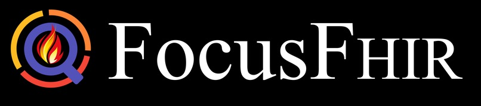

# MedicalDashboard

## Inspiration
In the rapidly evolving world of healthcare, the need for personalized and efficient data management has never been more crucial. Our team member Vishal can back this up - he held an internship at the BC Children’s hospital for almost an year. One thing that he noticed was that the program used to display the medical data, Cerner, was incredibly inefficient. The program essentially just directly displayed all of the patients raw data, as long and disorganized forms scattered all across, with doctors having to click and search through multiple tabs simply to see the same two separate data points that they always see. Curious about this, our team interviewed some doctors, and they too have complained about the inefficiency of the display of the patient data. It is the bane of new doctors to have to learn to use this system, and much less, get used to it. In fact, Vishal spent almost half of his entire internship at the hospital simply to help create a more specific UI dashboard for doctors to decide sedation amounts.

Because of this, we seek to create a new system to effectively streamline the display and processing of medical information files by allowing doctors to specifically tailor their needs, into the display of files. Using the standardized patient information file format FHIR - used by both the US and Canada - we created FocusFHIR.

## What it does
FocusFHIR is a specialized tool designed for healthcare professionals, enabling them to tailor applications to their specific needs. In the medical field, FHIR format files contain patient data encompassing all the health and medical information of a patient. As previously mentioned, this information is then usually displayed directly using the exact same format, regardless of the speciality of the doctor, leading to a highly convoluted process of the doctor having to manually find the relevant patient data needed in the haystacks of information presented. So much so that many hospitals opted to create their own specialized programs to display the specific information needed, spending much time and resources for development.

However, with FocusFHIR, doctors can now efficiently create customized applications that prioritize the essential information for their specialty, streamlining their workflow without any coding knowledge.

For instance, typically, a cardiologist is usually most concerned about information such as blood pressure, and the results of previous heart diagnostics. Usually, the doctor has to constantly go through multiple menus to look for these two data points in between otherwise unessential information, such as glasses prescriptions, or immunization records. With FocusFHIR, the cardiologist can then create their own, more streamlined application dashboard. Simply by selecting the data they need to see, FocusFHIR will then generate its own application to process the FHIR files according only to what the doctor needs, using “SMART on FHIR” app flow security in its data retrieval, to the same standard as industry leaders such as the Apple Smartwatch.

Our platform is not just another healthcare data management system. It’s a tool that puts the power of data customization in the hands of those who know their needs best - the healthcare professionals themselves.

## How we built it
FocusFHIR was crafted using a diverse tech stack to ensure a robust and user-friendly platform. Our frontend development was powered by JavaScript and React, providing an interactive and dynamic user interface. We employed Material-UI for design components and leveraged Tailwind CSS to enhance styling and responsiveness.

On the backend, we utilized Express, a Node.js framework, to handle server-side logic. SQL served as our database management system, enabling efficient storage and retrieval of medical data. AWS played a crucial role in hosting and deploying our application, providing a scalable and reliable infrastructure.

For seamless communication between the frontend and backend, we implemented RESTful APIs, utilizing API Gateway to manage and secure these interactions. The entire design and prototyping process were streamlined using Figma, ensuring a cohesive and visually appealing user experience.

In summary, our development journey involved a fusion of JavaScript, React, SQL, AWS, REST, API Gateway, Tailwind, Material-UI, CSS, HTML, Express, and Figma, allowing us to create FocusFHIR with a balance of functionality and aesthetics.

## Challenges we ran into
One significant challenge we faced was initially struggling to interpret the FHIR file format accurately. However, we persevered and overcame this obstacle through a combination of collaborative efforts, trial and error, and continuous learning. Another challenge was the temptation to change our topic due to uncertainties, but our commitment to the idea prevailed, leading to a successful outcome.

##Accomplishments that we're proud of
We take pride in successfully creating FocusFHIR, a tool that empowers healthcare professionals to customize their applications without any coding knowledge. Our team's ability to stick to the original idea, overcome challenges, and deliver a functional solution is a notable accomplishment. Additionally, we're proud of integrating the SMART on FHIR security measures, ensuring data privacy and compliance with industry standards.

## What we learned
Throughout the development process, our team gained valuable insights into healthcare data management, the FHIR file format, and the importance of adaptability in problem-solving. We learned to navigate challenges collaboratively, enhancing our technical skills and deepening our understanding of the healthcare IT landscape.

## What's next for FocusFHIR
Looking ahead, we plan to further enhance FocusFHIR by incorporating machine learning algorithms to provide predictive analytics. This will enable healthcare professionals to anticipate patient needs and streamline decision-making. We also aim to collaborate with healthcare institutions for real-world testing and refinement, ensuring that FocusFHIR meets the evolving demands of the healthcare industry.
